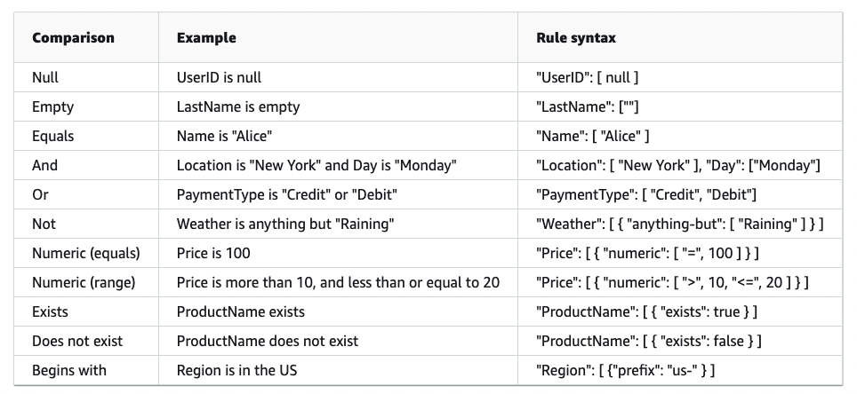

# Eventbridge

Serverless event bus service. Is able to receive events on event-buses and given a list of rules decide the target to send the event.

## Glossary

- event: significant change of environment
- Target: destiny of the event
- Rule: pattern assigned to each event-bus that decides to which target the event should be sent
- event-bus: lane to receive events. Accepts up to 300 rules

## Events

- Represented in json.
- Can have up to 512 KB
- Has the following attributes:
  - Version:
  - Id: version 4 UUID
  - DetailType: identifies the fields and values for the detail field
  - Source: source of the event (custom events can't start with aws)
  - account: 12 digit identifying aws account
  - time: timestamp of the event when it happened (don't confuse with process time)
  - region:
  - resources: json array with ARNS involved in the event
  - Detail: json object with event information
- Minimin events are _detail_, _detail-type_ and _source_

### Event patterns

[Quotas](https://docs.aws.amazon.com/eventbridge/latest/userguide/eb-quota.html)

## Rules

Can send events to one or more targets (up to 5 per rule). Can be triggered either by event pattern or by scheduling. The scheduling is based on cron and can be used to, for example, run a lambda function

## Target

- The target parameters can change depending on the target. Some supported params are:
- BatchParameters (AWS Batch jobs)
- EcsParameters (Amazon ECS tasks)
- HttpParameters (Amazon API Gateway and 3rd party ApiDestination endpoints)
- KinesisParameters (Amazon Kinesis streams)
- RedshiftDataParameters (Amazon Redshift Data API clusters)
- RunCommandParameters (Amazon EC2 Instance commands)
- SageMakerPipelineParameters (Amazon SageMaker Model Building Pipelines)
- SqsParameters (Amazon SQS queues)

## Input transformer

Allows to change the event before it's passed to the target of a rule

## Archive

Allows to store past events. Can define the time to store events(1 day to ∞)

## Replay

Allow to reprocess a past event that was stored on Archive. The event must be replayed to the same event-bus it originally was processed by.

## Global endpoints

Used to improve app availability. Using route 53 it checks the endpoint health and if down sends the events to the secondary region. After it's back, the events are sent to the primary region.

- Event replication can be enabled

## Schemas

- Defines the structure of the events that are sent to eventbridge. With this service we can download code bindings for popular promgraming languages.
- Supports OpenAPI 3 and JSONSchema Draft4
