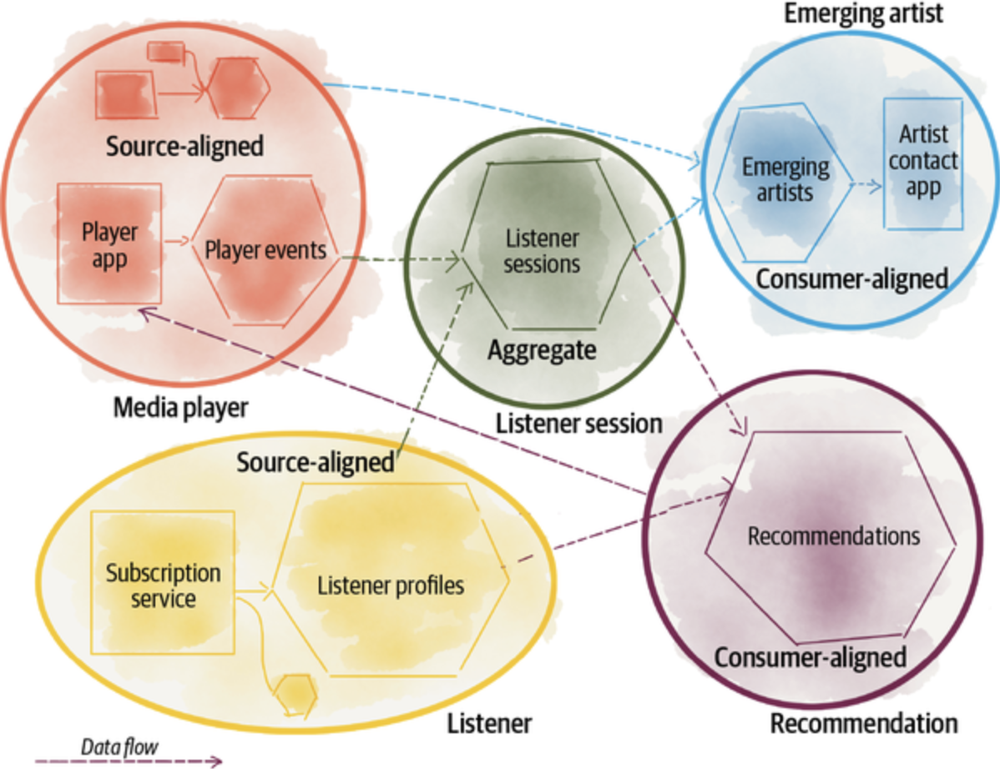
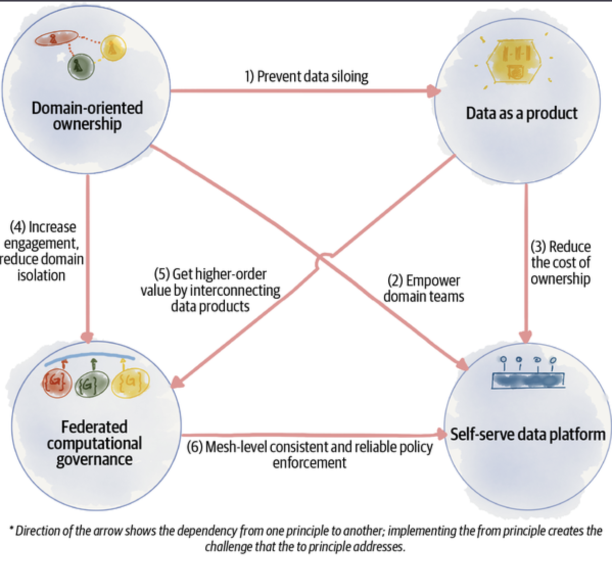
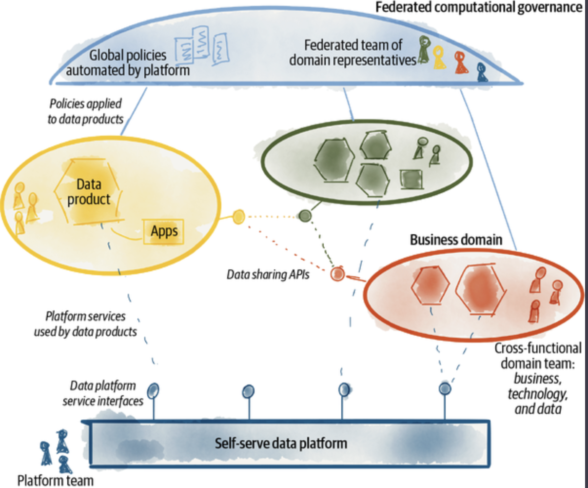
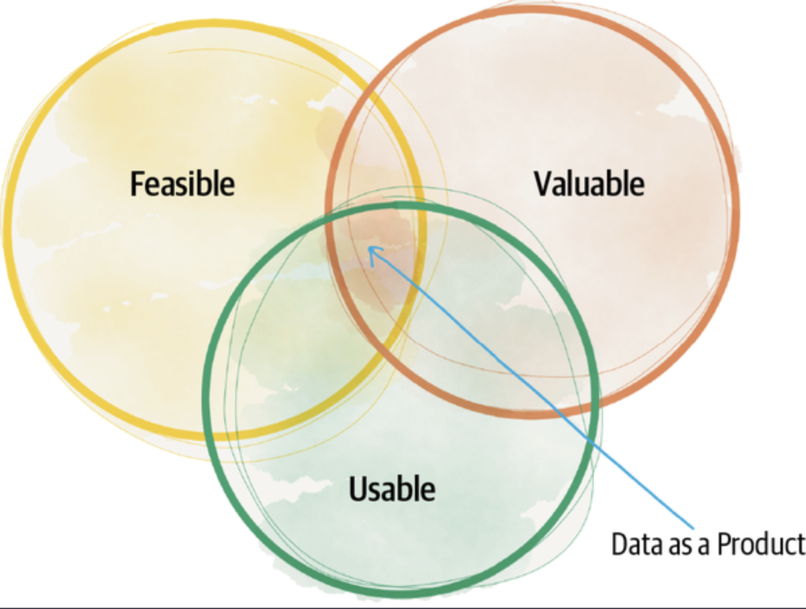
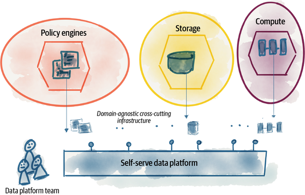
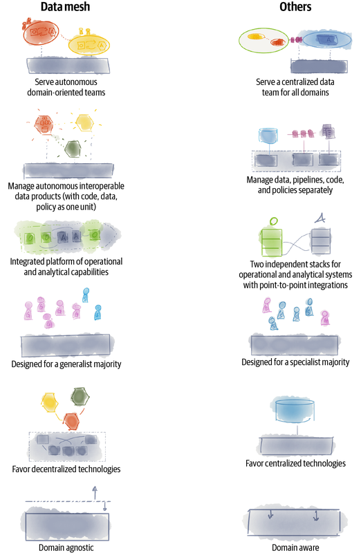
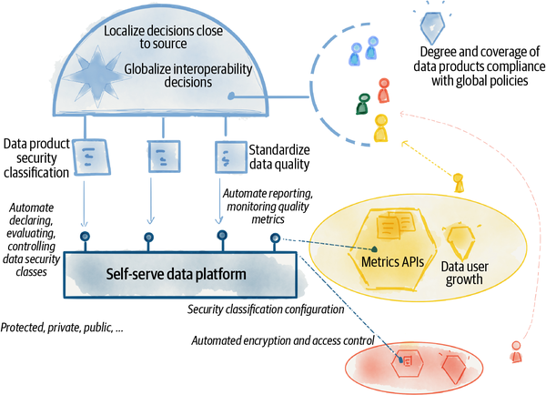

# Data Mesh

## Principes

- Decentralized Domain ownership
- Distributed architecture
- Data and code as a single unit
- Federated computational governance
- Data as a product
- Integrated Platform

### Principle of Domain Ownership

Decentralize the ownership of analytical data to business domains closest to the data—either the source of the data or its main consumers. Decompose the (analytical) data logically and based on the business domain it represents, and manage the life cycle of domain-oriented data independently.

Architecturally and organizationally align business, technology, and analytical data.

The motivations of domain ownership are:

- The ability to scale out data sharing aligned with the axes of organizational growth: increased number of data sources, increased number of data consumers, and increased diversity of data use cases
- Optimization for continuous change by localizing change to the business domains
- Enabling agility by reducing cross-team synchronizations and removing centralized bottlenecks of data teams, warehouses, and lake architecture
- Increasing data business truthfulness by closing the gap between the real origin of the data, and where and when it is used for analytical use cases
- Increasing resiliency of analytics and machine learning solutions by removing complex intermediary data pipelines

DDD’s Strategic Design embraces modeling based on multiple models each contextualized to a particular domain, called a bounded context.

A bounded context is “the delimited applicability of a particular model [that] gives team members a clear and shared understanding of what has to be consistent and what can develop independently.”

TLDR: The data platform can create a streamline way of sharing the data but each team must use it and define a contract with it on what is expected of it.

There are three archetypes of domain-oriented data:

**Source-aligned domain data**: Analytical data reflecting the business facts generated by the operational systems. This is also called a native data product.
**Aggregate domain data**: Analytical data that is an aggregate of multiple upstream domains.
**Consumer-aligned domain data**: Analytical data transformed to fit the needs of one or multiple specific use cases. This is also called fit-for-purpose domain data.

TIP: Avoid ambitious domain data. Data mesh proposes that end consumers compose their own fit-for-purpose data aggregates and resist the temptation of highly reusable and ambitious aggregates.

### Principle of Data as a Product

With this principle in place, domain-oriented data is shared as a product directly with data users—data analysts, data scientists, and so on.

Data as a product adheres to a set of usability characteristics:

- Discoverable
- Addressable
- Understandable
- Trustworthy and truthful
- Natively accessible
- Interoperable and composable
- Valuable on its own
- Secure

Data product SLOs include, among others:

- **Interval of change**:How often changes in the data are reflected
- **Timeliness**:The skew between the time that a business fact occurs and becomes available to the data users
- **Completeness**:Degree of availability of all the necessary information
- **Statistical shape of data**:Its distribution, range, volume, etc.
- **Lineage**:The data transformation journey from source to here
- **Precision and accuracy over time**: Degree of business truthfulness as time passes
- **Operational qualities**:Freshness, general availability, performance

#### Tips

- Think of Data as a Product, Not a Mere Asset
- Join Data and Compute as One Logical Unit

### Principle of the self-serve data platform

The data platform exists as a way to provide a simple interface for each data owner to manage their data without requiring a data engineer.

Some requirements of a data plaform:

- Analytical data storage in the form of a lake, warehouse, or lakehouse
- Data processing frameworks and computation engines to process data in batch and streaming modes
- Data querying languages, based on two modes of computational data flow programming or algebraic SQL-like statements
- Data catalog solutions to enable data governance as well as discovery of all data across an organization
- Pipeline workflow management, orchestrating complex data pipeline tasks or ML model deployment workflows

The characteristics of a data mesh platform are the following:

- Enable autonomous teams to get value from data
- Exchange value with autonomous and interoperable data products
- Accelerate exchange of value by lowering the cognitive load
- Scale out data sharing
- Support a culture of embedded innovation
- Abstract complexity through declarative modeling
- Abstract complexity through automation
- The platform itself is a product

### Principle of federated computational governance

The focus of this chapter is the high-level modeling of the data governance team and function, and not the individual concerns that governance must assure, like privacy, security, GDPR, or other policies. In short, in this chapter I aim to address the uneasy feeling of loss of control and indeterminism that a decentralized data ownership model like data mesh can arise in many of my tenured data steward and governance colleagues.

#### Tips

- Localize decisions and responsibility close to the source
- Identify cross-cutting concerns that need a global standard
- Globalize decisions that facilitate interoperability
- Identify consistent experiences that need a global standard
- Execute decisions locally

#### Define Standards as Code

**Data product discovery and observability interfaces**: APIs that expose discoverability information, documentation, schema, and SLOs
**Data product data interfaces**: APIs that expose the data
**Data and query modeling language**: Modeling of semantics and syntax of data and the query language operating on the data
**Lineage modeling**: Modeling of the traces of data flows and operations across connected data products
**Polysemes identification modeling**: Modeling of identity systems that globally identify and address common business concepts across different data products

#### Define Policies as Code

**Data privacy and protection**: Strategies to prevent data from being stolen, lost, or accidentally deleted. Ensure that sensitive data is accessible only to approved parties.
**Data localization**: Requirements around geolocation of data storage and its processing.
**Data access control and audit**: Control who can access what elements of the data and keep track of all accesses.
**Data consent**:Track and control what information the data owners allow to be preserved and shared.
**Data sovereignty**: Preserving the ownership of data and its control.
**Data retention**: Managing the availability and storage of data according to the defined retention duration and policy.

#### Automated tests

### Automated monitoring

## Inflection point

- Great expectations of data
- great divide of data
- scale
- business complexity and volatility
- discord between investment and returns
