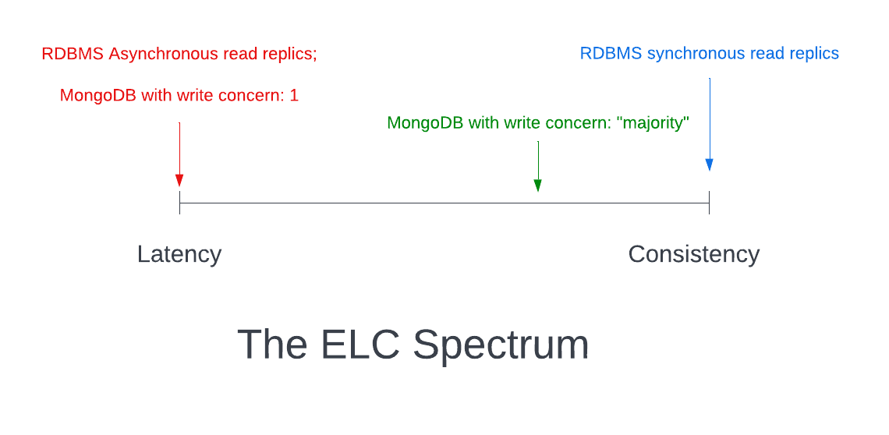

# Databases

## Data Consistency

The CAP Theorem is fundamentally about replication, specifically network failures during replication.

- CAP theorem

  - Consistency: on a read receive the most recent item
  - Availability: receive non-failing response
  - Partition tolerance: system operation despite network traffic disruption between nodes

- PACELC theorem
  - Extension of CAP
  - It states that in case of network partitioning (P) in a distributed computer system, one has to choose between availability (A) and consistency (C) (as per the CAP theorem), but else (E), even when the system is running normally in the absence of partitions, one has to choose between latency (L) and consistency (C). (source [wiki](https://en.wikipedia.org/wiki/PACELC_theorem))

## ACID

ACID refers to a set of guarantees about the behavior of a database when combining multiple operations in a single, logical operation (often called a “transaction”).

- ATOMICITY: all operations succedd or fail together
- CONSISTENCY: the database is in a valid state following the transaction
- ISOLATION: concurrent transactions are treated as executed sequentially
- Durability: a committed transaction will be saved even in the event of a failure

## Linearizability

It states that once your system accepts and completes a write operation for a piece of data, all subsequent operations on that data should reflect that write.

## Serializability

Decides how to treat concurrent transactions on the same underlying pieces of data.

## Eventual Consistency

> At a very high level, the notion of ”eventual consistency” refers to a distributed systems model where, to quote Wikipedia, “if no new updates are made to a given data item, eventually all accesses to that item will return the last updated value.”

# Links

https://www.alexdebrie.com/posts/dynamodb-eventual-consistency/
