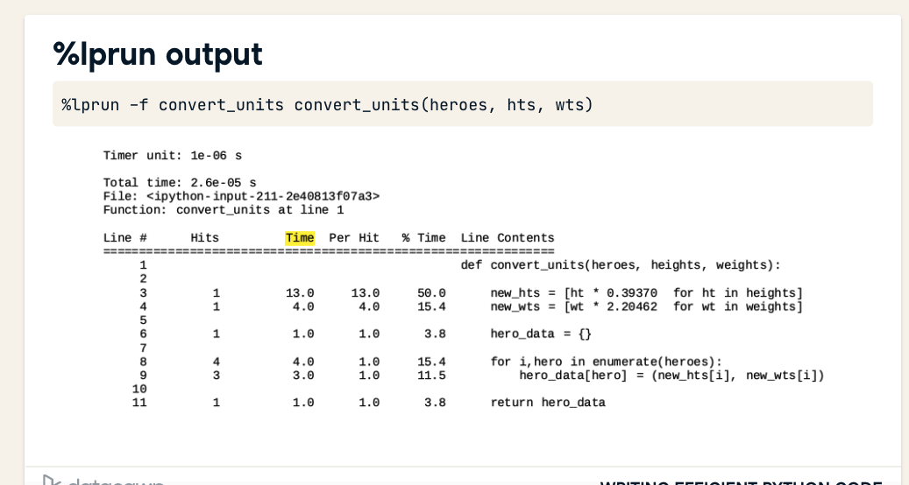

# Python

## Local Installation

- Pyenv: Multiple system python versions
- Pipx: Install isolated CLI applications (i.e: dbt, airflow)
- Poetry: Install project in a virtual env

### Memory management

- Use generators
- Numpy array is faste than normal arrays
- Use [] instead of list() and {} instead of dict()
- Avoid + operator for strings
- Assign function to local variable (+ efficient than accessing global vars)
- use built-in functions and libraries
- Use itertools to avoid loops (funcional programming)

### Runtime

Use the follow to get timing running sections of code

```python
%timeit functiontotest()

%%timeit
for i in list:
  print(i)
```

### Profiler

Use line_profiler package

```python
%load_ext line_profiler


```



### Import system

https://tenthousandmeters.com/blog/python-behind-the-scenes-11-how-the-python-import-system-works/

## Linters

- Pylint
- Flake8,
- Pyflakes
- pycodestyle
- Ruff: Rust implementation ([source](https://lwn.net/Articles/930487/))
  - Supports python 3.7 and above

## Autoformatters

- Black
