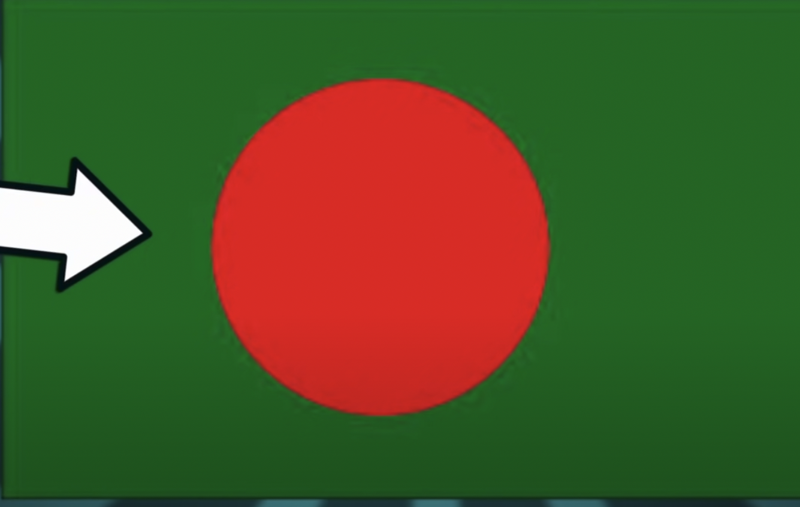
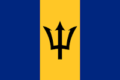

# Geography

Stuff about countries

## Afghanistan

Capital: Cabul

## Albania

Capital: Tirana

## Algeria

Capital: Algel

## Andorra

Capital: andorra-la-vella

## Angola

Capital: Luanda

## Antigua and Barbuda

Capital: São João

## Argentina

Capital: Buenos Aires

## Armenia

Capital: Yerevan

## Australia

Capital: Canberra

## Austria

Capital: Vienna

## Azerbaijan

Capital: Baku

## Bahamas

Capital: Nassau

## Bahrain

Capital: Bahrain

## Bangladesh

Capital: Dhaka

- Tem a maior praia do mundo (75 KM)
- Parte da praia é um cemitério de barcos
- Tem o delta do Ghanges

## Barbados

Capital: Bridgetown

- ilha de 94km de costa, fora da zona das caraibas.
- Tem a destilaria mais antiga de rum.
- Rihanna é daqui.
- Falam inglês,
- Colônia da Inglaterra.
- Tax haven

## Japan

Capital: Toyo

Old Capital: Quioto

- Known Regions
  - Okkaido
    - Ilha a norte
    - Add the Ainu before the common "Japanese" appeared
  - Okinawa
    - Ilhas tropicais a sul
    - Em tempos era o reino de Ryukyu (tributary state da China)
    - Mais tarde (1609) passou a ser um estado fantoche do Japão
    - Em 1879 passou a ser parte do Japão
    - A lingua original é o Uchinaguchi
